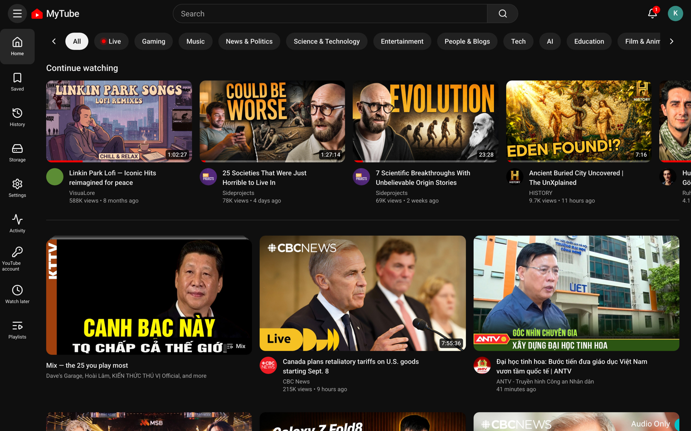
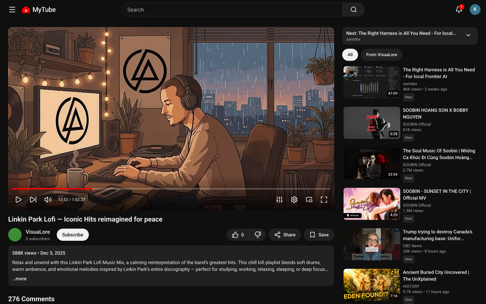
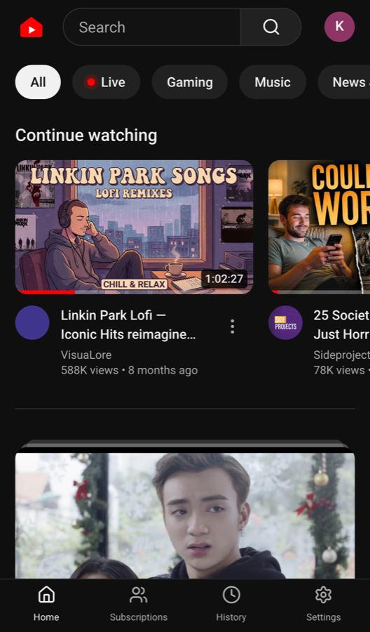
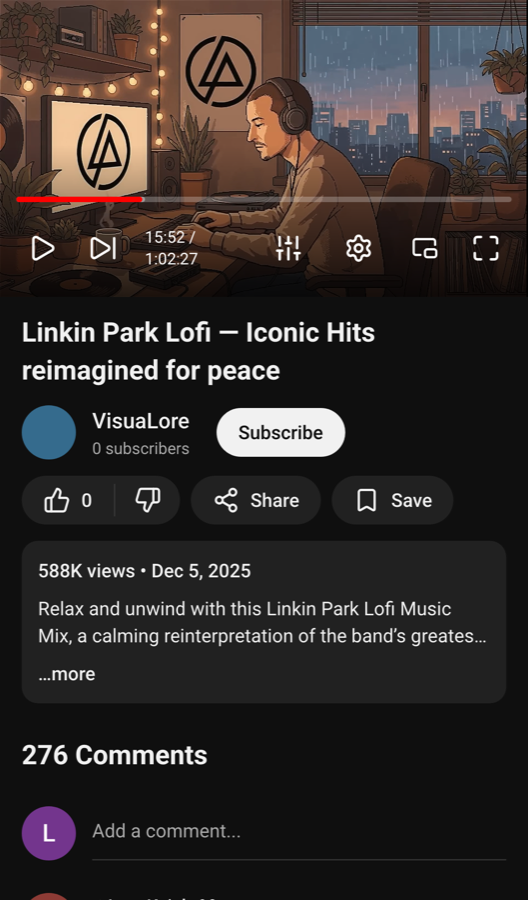

# Local Mytube

A self-hosted video library for the home LAN. `yt-dlp` is the **ingest tool**,
not a streaming proxy: a video is fetched to disk once and then served from your
own network.

**[English](#english) · [Tiếng Việt](#tiếng-việt)**

---

## English

### What it is

Built for a household of two to five people on one machine. Videos come in from
YouTube — pasted links, followed channels, or a curated `topics.yaml` — and are
kept on a disk you own until a budget you set decides otherwise.

- **Plays before it has downloaded.** The first seconds come from YouTube's own
  adaptive tracks; the player switches to the local file when it lands, a median
  of thirteen seconds later.
- **A home feed you can explain.** Heuristic ranking, no ML, and an endpoint
  that will show you every video's score component by component.
- **Per person, one library.** Subscriptions, history and recommendations are
  yours; the videos are the household's.
- **English and Tiếng Việt**, switchable from the avatar.
- **Optional**: subtitle translation, and reading them aloud, through any
  service that speaks OpenAI's API.

### What it looks like

Desktop and phone are the same application — a feature-sliced `ui/` layer over
one set of use cases, not two front ends.

| Home | Watch |
|---|---|
|  |  |

<p align="center">
  
  
</p>

### Getting started

| | |
|---|---|
| **[docs/SETUP.md](docs/SETUP.md)** | from an empty machine to a working install |
| **[docs/USAGE.md](docs/USAGE.md)** | what each screen does |
| [CLAUDE.md](CLAUDE.md) | every architectural decision and why |
| [design-system/…/MASTER.md](design-system/local-youtube/MASTER.md) | UI tokens |

```bash
brew install go node postgresql@17 ffmpeg
brew services start postgresql@17
pipx install "yt-dlp==2026.8.19"

psql -d postgres -f db/bootstrap.sql
# then every migration — see docs/SETUP.md §2

./scripts/dev.sh          # → http://localhost:5173
```

The setup guide is written so that an AI assistant can follow it for you: every
step ends in something to check.

### Layout

```
proto/          Schemas. The single source of truth for every service boundary.
gen/go/         Generated Go (connect-go). Committed.
services/
  catalog/      Videos, channels, comments, per-user state, storage.
  recsys/       Ranking only. Returns ordered ids, never metadata.
  ingest/       yt-dlp: discovery, stream resolution, the download queue.
  gateway/      The only origin the browser talks to. REST out, ConnectRPC in.
web/            Vite + React client.
db/             Bootstrap and development seeds.
```

Ports: gateway `8180`, catalog `8181`, recsys `8182`, ingest `8183`,
logview `8184`, Vite `5173`.

### Requirements

Go 1.26 · Node 22 · PostgreSQL 17 · ffmpeg 8 · yt-dlp (pinned) · Python 3 for
the two optional sidecars.

### A note on scope

This is one household's library, published in case it is useful. It assumes a
trusted LAN: media URLs are unprotected and profiles are a convenience rather
than a login. Read [CLAUDE.md §6b](CLAUDE.md) before putting it anywhere else.

### Disclaimer

**This is a learning project.** It was written to work through microservices
with ConnectRPC, clean architecture in Go, a heuristic recommender you can
explain line by line, and a React client built without a component library. The
code and the reasoning behind it — see [CLAUDE.md](CLAUDE.md) — are the point.

- **Not affiliated with YouTube or Google**, and not endorsed by either. Product
  names and trademarks belong to their owners; nothing here is theirs.
- **It downloads material somebody else made.** Doing that may be against
  YouTube's Terms of Service and, depending on the material and where you live,
  against the law. Whoever runs this decides what to ingest and carries that
  decision — the author does not, and nothing in this repository is advice that
  any particular use is permitted.
- **Personal use, on your own network.** Not for redistribution, not for public
  or commercial streaming, and not for stripping other people's work of its
  source. Support the creators you watch.
- **No warranty of any kind.** It talks to a service that changes without
  notice; it can break on a morning nobody touched it, and it can lose things
  you cared about. Keep your own backups.

Use it to learn from. Anything beyond that is on you.

### Licence

[MIT](LICENSE). The licence covers this code and nothing else: it says nothing
about the videos you put into it, which belong to whoever made them.

---

## Tiếng Việt

### Đây là gì

Một thư viện video tự dựng, chạy trong mạng nhà. `yt-dlp` ở đây là **công cụ nạp
video**, không phải proxy stream: video được tải về đĩa một lần rồi phát từ mạng
của bạn.

Làm cho một nhà 2–5 người dùng chung một máy. Video vào thư viện qua link dán
tay, qua kênh bạn theo dõi, hoặc qua danh sách nguồn trong `topics.yaml` — và nằm
trên ổ đĩa của bạn cho tới khi hạn mức bạn đặt quyết định khác.

- **Phát trước khi tải xong.** Mấy giây đầu lấy từ chính track adaptive của
  YouTube; khi file về tới nơi player chuyển sang bản trên đĩa, trung vị 13 giây.
- **Trang chủ giải thích được.** Xếp hạng theo quy tắc, không ML, và có endpoint
  cho bạn xem điểm từng video theo từng thành phần.
- **Của riêng từng người, thư viện dùng chung.** Kênh đăng ký, lịch sử và gợi ý
  là của bạn; video là của cả nhà.
- **English và Tiếng Việt**, đổi từ menu avatar.
- **Tuỳ chọn**: dịch phụ đề và đọc phụ đề thành tiếng, qua bất kỳ dịch vụ nào nói
  được API của OpenAI.

### Nhìn nó ra sao

Bản desktop và bản điện thoại là cùng một ứng dụng — một lớp `ui/` đặt trên cùng
một bộ use case, không phải hai front end.

| Trang chủ | Xem video |
|---|---|
|  |  |

<p align="center">
  
  
</p>

### Bắt đầu

| | |
|---|---|
| **[docs/SETUP.vi.md](docs/SETUP.vi.md)** | từ máy trắng tới bản chạy được |
| **[docs/USAGE.vi.md](docs/USAGE.vi.md)** | mỗi màn hình làm gì |
| [CLAUDE.md](CLAUDE.md) | mọi quyết định kiến trúc và lý do |

```bash
brew install go node postgresql@17 ffmpeg
brew services start postgresql@17
pipx install "yt-dlp==2026.8.19"

psql -d postgres -f db/bootstrap.sql
# rồi chạy từng migration — xem docs/SETUP.vi.md §2

./scripts/dev.sh          # → http://localhost:5173
```

Hướng dẫn cài đặt được viết để **nhờ AI làm hộ cũng được**: mỗi bước đều kết thúc
bằng một thứ để kiểm chứng.

### Cấu trúc

```
proto/          Schema. Nguồn sự thật duy nhất cho mọi ranh giới service.
gen/go/         Go sinh tự động (connect-go). Có commit.
services/
  catalog/      Video, kênh, bình luận, trạng thái theo người dùng, ổ đĩa.
  recsys/       Chỉ xếp hạng. Trả về id đã sắp thứ tự, không bao giờ trả metadata.
  ingest/       yt-dlp: tìm kiếm, phân giải luồng, hàng chờ tải.
  gateway/      Nơi duy nhất trình duyệt nói chuyện. REST ra ngoài, ConnectRPC vào trong.
web/            Client Vite + React.
db/             Bootstrap và dữ liệu mẫu.
```

Cổng: gateway `8180`, catalog `8181`, recsys `8182`, ingest `8183`,
logview `8184`, Vite `5173`.

### Yêu cầu

Go 1.26 · Node 22 · PostgreSQL 17 · ffmpeg 8 · yt-dlp (ghim phiên bản) · Python 3
cho hai service phụ tuỳ chọn.

### Một lưu ý về phạm vi

Đây là thư viện của một gia đình, công khai phòng khi có ích cho ai đó. Nó giả
định mạng LAN đáng tin: link media không được bảo vệ, và hồ sơ người dùng là tiện
lợi chứ không phải đăng nhập. Đọc [CLAUDE.md §6b](CLAUDE.md) trước khi đem nó đặt
ở nơi khác.

### Miễn trừ trách nhiệm

**Đây là sản phẩm làm để học.** Viết ra để đi hết một vòng microservice với
ConnectRPC, clean architecture bằng Go, một bộ gợi ý thuần quy tắc mà giải thích
được từng dòng điểm số, và một client React dựng tay không dùng thư viện
component. Phần đáng giá là code và lý do đằng sau nó — xem [CLAUDE.md](CLAUDE.md).

- **Không liên kết với YouTube hay Google**, cũng không được hai bên đó bảo trợ.
  Tên sản phẩm và nhãn hiệu thuộc về chủ của chúng; ở đây không có gì là của họ.
- **Nó tải nội dung do người khác làm ra.** Việc đó có thể vi phạm Điều khoản dịch
  vụ của YouTube, và tuỳ nội dung với nơi bạn sống, có thể vi phạm pháp luật. Ai
  chạy phần mềm này thì tự quyết định nạp gì vào và tự chịu quyết định đó — tác
  giả không chịu thay, và không có dòng nào trong repo này là lời khuyên rằng một
  cách dùng cụ thể nào đó được phép.
- **Dùng cá nhân, trong mạng nhà bạn.** Không phát tán lại, không phát công khai
  hay kinh doanh, và không bóc công sức người khác khỏi nguồn của nó. Hãy ủng hộ
  những kênh bạn xem.
- **Không bảo hành gì hết.** Nó nói chuyện với một dịch vụ thay đổi không báo
  trước; nó có thể hỏng vào một buổi sáng không ai đụng tới, và có thể làm mất thứ
  bạn quý. Tự giữ bản sao lưu.

Lấy nó mà học. Ngoài chuyện đó ra thì bạn tự chịu.

### Giấy phép

[MIT](LICENSE). Giấy phép này chỉ áp cho phần code ở đây, không áp cho thứ gì
khác: nó không nói gì về những video bạn nạp vào, chúng thuộc về người làm ra.
